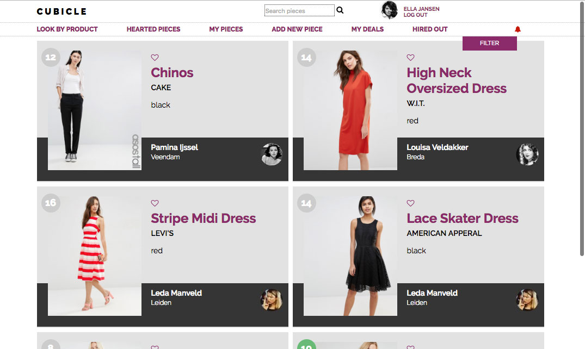

# **CUBICLE**
#### Ruby on Rails clothing exchange platform
Final assignment for the two months training at Codaisseur

september 2016

---
Check out the the app running at Heroku:  [https://secure-plains-87033.herokuapp.com](https://secure-plains-87033.herokuapp.com)

**Concept**

In week two of our training we were asked to build an AirBnB-like platform. The idea of a website were you could exchange cq. rent out clothing did not land with my team mates. We build another cool platform (see [https://github.com/nuiver/help-for-hire](https://github.com/nuiver/help-for-hire)). After we finished the week project I decided to build it anyway and I started to use this side project as a sandbox.

**Used technologies**
* Rails
* Ruby
* Javascript
* jQuery
* AJAX

**Aspects I am proud of**

I build three ways to search for items from scratch: search field, dropdown menu and an advanced filter to further narrow down within the shown results (on size, piece, product type and availability).

I managed to have a complete working reservation system. One user goes through a two step check out proces (shown in a floating modal windows). The other user gets a warning and is invited to review and finalize the deal. Besides the logical challenges (like how do visualize and check availibilty during the checkout) I also enjoyed the front-end part a lot with all the jQuery and AJAX.

Users can 'heart' the items they like. These likes are stored realtime with AJAX. In the menu bar the now can navigate to an overview of their 'hearted pieces'.

Lines that relatively took a lot of time, were the ones that communicate with the Google Maps API. I really wanted to implement something going on with a distant API. Now the virtual Cubicle user can see far they are separated from their favourite pieces (and all others...)

Ok, I know the tests in this project are poor in terms of quantity, but I am happy I got the change to show I can write them.

**Possible improvements aka wish list**
* Improve the search results with Elastic search
* Improve the filter with actual amounts for the filter options
* Improve cancancan user autorization, now it's quite hacky...
* Add responsive design
